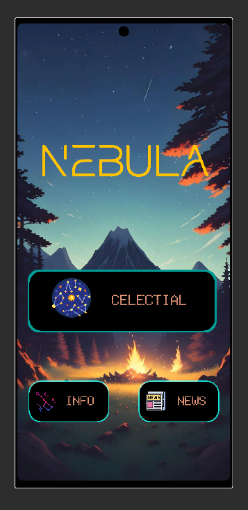
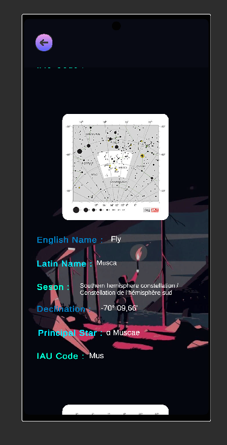
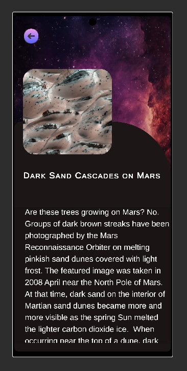
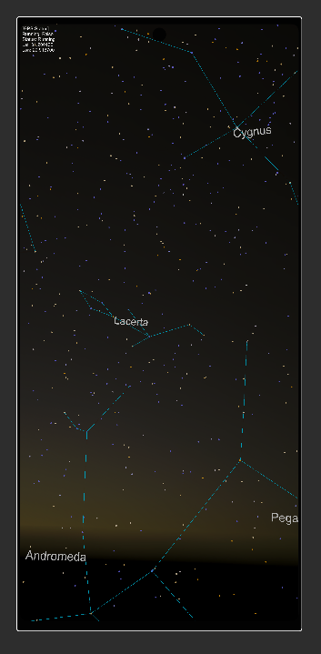
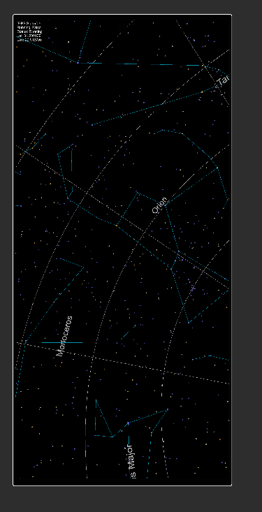
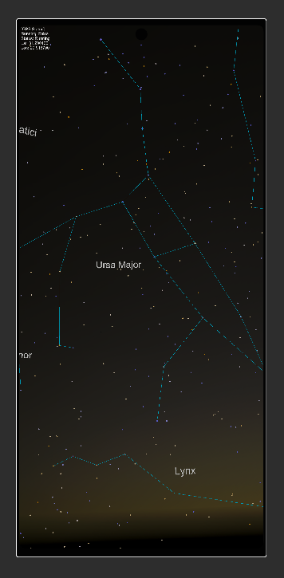
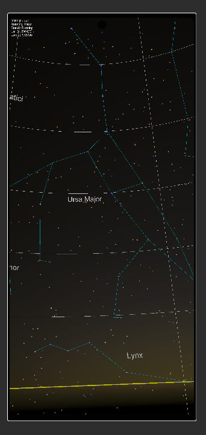

# 🌌 Nebula — Real-Time 3D Star Map

**Nebula** is a 3D interactive star map built with Unity, powered by real astronomical data from the Bright Star Catalog. It simulates a real-time view of the night sky using your device’s orientation and location, aligning the stars and constellations to match your horizon.

This project blends science, design, and immersive tech to create an educational sky exploration experience. 🌠

---

## ✨ Live Features

- 🌍 **Real-time celestial sphere** based on your location
- 🌠 **9,110+ stars** rendered from the **Bright Star Catalog (Yale University)**
- 🔭 **88 official constellations** with:
  - Shapes & line connections
  - Constellation names and labels
- 🧭 **Horizontal coordinate system**:
  - The view matches your real sky when you point your phone
- 🎮 Built entirely in **Unity** (C#) for Android

---

## 🧠 The Science Behind Nebula

The stars are based on the **Bright Star Catalog** — a dataset from the Yale University Astronomical Observatory, containing the brightest 9,110 stars visible to the naked eye from Earth. Each star includes:

- RA (Right Ascension) and Declination
- Apparent Magnitude
- Spectral Type
- Bayer or Flamsteed Designation (when available)

The constellations are drawn using standard IAU (International Astronomical Union) definitions.

---

## 🪐 Roadmap (Planned Features)

> Help turn Nebula into the most complete astronomy app in Unity!

- ☀️ **Add Solar System objects**:
  - Sun, Moon, planets (real-time positions)
- 🔭 **Deep Sky Objects**:
  - Messier and NGC catalog support (galaxies, nebulae, clusters)
- 🧭 **Celestial coordinate switching**:
  - Equatorial ↔ Horizontal system toggling
- 🛰️ AR Mode (Mixed Reality support)
- 🕳️ Black holes & Exoplanet markers
- 📝 In-app astronomical encyclopedia (with AI-powered assistant)
- 🌌 Optional time travel: explore past and future sky maps

---

## 🧪 Tech Stack

- 🎮 **Unity** (C#)
- 🧠 **Astronomical data**: Bright Star Catalog (Yale University)
- 🌐 **Real-time orientation**: Unity sensors
- 🧱 GameObject pooling & sky rendering optimization

---


## 📸 Screenshots

<p align="center">
  
  
  
  
  
  
  
</p>
---

## 🛠️ Getting Started

### Requirements

- Unity (version 2022.3+)
- Android SDK (if building for mobile)

### Steps

```bash
git clone https://github.com/YOUR_USERNAME/Nebula.git
